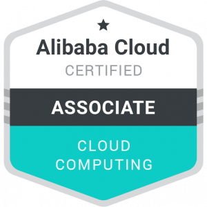

     <!-- Logo -->
    <h1>ACA Cloud Computing Certification</h1> <!-- Title -->
    

      Cheat Sheet for ACA Cloud Computing Certification. This is a summary, not a non-exhaustive list, so definitions are concise & explanations are removed.
    
 <!-- Description -->

---

Table of Contents

- [Materials](#materials)
- [Content](#content)
  - [ECS (Elastic Compute Service)](#ecs-elastic-compute-service)
  - [VPC](#vpc)
  - [SLB (Server Load Balancer)](#slb-server-load-balancer)
  - [OSS (Object Storage Service)](#oss-object-storage-service)
  - [RDS (Relational Database Service)](#rds-relational-database-service)
  - [Auto Scaling](#auto-scaling)
  

## Materials

- [Optional] [Operate & Manage a Cloud Server](https://edu.alibabacloud.com/course/7)
- [Optional] [Alibaba Cloud Introduction](https://edu.alibabacloud.com/course/387)
- [ACA Cloud Computing Fundamentals](https://edu.alibabacloud.com/course/353)

## Content

### ECS (Elastic Compute Service)

**ECS**: Cloud computing service.

- **ECS as IaaS**: Users manage Application, Data, RUntime, Middleware, OS layers. Alicloud manages Virtualisation, Servers, Storage, Networking layers.
- **Apsara**: Apsara handles storage, scheduling, networking, resource management & distributed coordination for all Alicloud products.
- **Zones & Regions**: Multiple (typically 3) zones within 1 region.

**ECS Instance**: Individual cloud VM.

- **ECS Instance Types**
  1. **T / S**: Burstable / light workloads.
  2. **G / C**: General purpose & compute-intensive workloads.
  3. **D**: Big data applications.
  4. **R**: High memory applications.
  5. **I**: IO intensive workloads.
  6. **H**: High CPU clock speed.
- **Bare Metal Instances**: Refers to literal physical machines, instead of VMs.
- **ECI (Elastic Container Instances)**: Component of ECS that allows containers to be run without allocating ECS Instances.
- **ECS Instance Failover Rate**
  - **Single Instance Uptime**: 99.975% / mth.
  - **Multi-zone Deployment Uptime**: 99.995% / mth.
- **ECS Instance Billing Model**
  1. **PAYG (Pay-As-You-Go)**
  2. **Subscription**: _NOTE: Can't delete instance & restart._
  3. **Preemptible Instance**: Similar to PAYG but via bid-based pricing. If bid is lower than asking price, instance is shut down.
  4. **Reserved Instances**: Hybrid of PAYG & Subscription by choosing a split of PAYG & upfront payment for specified amount of time.

**ECS Storage**

- **Pangu**: Name of distributed file system for ECS.
- **Cloud Disk**: Storage for ECS. Purchased separately of ECS instance. Must be mounted to instance in the **same zone**.
- **Cloud Disk Types**: _NOTE: Upgrades improve IOPS (IO Per Second) & throughput._
  1. **Ultra Disk**
  2. **Standard SSD**
  3. **Enhanced SSD**
- **Disk Snapshots**: Copies of data on a disk at certain time.
- **Disk Snapshot Types**
  1. **Manual Snapshot**: Up to **256** snapshots.
  2. **Auto Snapshot**: Snapshots are made based on snapshot policy, which details snapshot creation frequency & snapshot retention. Up to **1000** snapshots.
     **Disk Image**: Complete runtime env used to create an ECS instance. 4 types of Disk Images: Public, Marketplace, Custom, Shared (between Alibaba accounts).

**ECS Networking**

- **VPC (Virtual Private Cloud)**: Private network used to host ECS instance(s).
  - **VRouter**: Routes traffic within VPC.
  - **VSwitch**: Represents a subnet.
- **EIP (Elastic IP)**: Public IP address for VPC. Purchased separately of ECS. Can be moved between instances.
- **Security Groups**: Firewall rules that **allow** / **deny** traffic.
  - _NOTE: Security Groups are region-bound as VPCs are also region-bound._
- **VPC Communication with Internet**
  1. **Assign Public IP**: _NOTE: This public IP lives & dies with instance._
  2. **EIP**
  3. **Attach NAT Gateway to VPC Group**
  4. **SLB (Server Load Balancer)**: _NOTE: For inbound traffic only._
- **ENI (Elastic Network Interface)**: Virtual network interface to connect between ECS instance & public / private network.

**ECS Additional Settings**

- **Instance Metadata**: Contains Instance ID, IP, OS name.
- **User data**: Refers to input info related for automated bootstrapping when instance is created.

### VPC

### SLB (Server Load Balancer)

**SLB (Server Load Balancer)**: Traffic distribution control service that distributes traffic among ECS instances according to forwarding rules.

- **SLB Advantages**:
  1. **HA**: 99.95% service availability.
  2. **Scalability**
  3. **Low Cost**: Reduce cost by 60% compared to traditional hardware load balancers.
  4. **Security**: Defend against <5 Gbps DDoS attacks.

**SLB Architecture**

- **SLB Layers**:
  1. **Layer 4 (TCP / UDP)**: No header modification for traffic.
  2. **Layer 7 (HTTP / HTTPS)**: Header modification. `X-Forwarded-For` header contains client IP address.

**SLB Components**

- **SLB Instance**: Service that is region-bound. Receives incoming requests & forwards them to backend servers.
- **Listeners**: Listeners listens for client requests & decides where to send them. Also performs health checks on backend servers.
  - **Listener Configurations**:
    1. **Routing Rules**: How traffic is distributed among ECS instances.
       - **Round Robin**: Sequentially distributed.
       - **WRR (Weighted Round Robin)**: Distributed among weighted ECS instances, which can be set.
       - **WLC (Weighted Least Connections)**: Distributed among weighted ECS instances & number of connections.
    2. **Session Stickiness**: Ensures web traffic in session will be forwarded to same ECS instance.
    3. **Health Check**: Checks if ECS instances are functioning.
       - **Layer 7**: Health check via HTTP head request.
       - **Layer 4 (TCP)**: SLB sends SYN, SYN/ACK, ACK, RST.
       - **Layer 4 (UDP)**: SLB sends UDP probe & expects no response. ICMP Unreachable signifies failed health check.
  - **Listener Limitations**: < 50 listeners per SLB.
- **Backend Servers**: ECS instances.
  - **Backend Server Limitations**
    1. **No Cross-Region Deployment**
    2. **No Limitation on OS**
  - **Backend Server Groups**
    1. **Master-Slave Group (Layer 4)**: Request forwarded to slave server when master server is down.
    2. **VServer Group (Layer 7)**: For customised distribution, eg configuring domain name & URL forwarding rules.
- **SLB Cost Methods**
  1. **Public Network SLB**: Only supports PAYG billing mode.
  2. **Private Network SLB**: Free.

**SLB Additional Settings**

- **SLB Multi-Zone Disaster Tolerance**: Utilise the Primary / Backup Zone feature.
- **Cross-Region Disaster Tolerance**: SLB does NOT help. Use DNS failover capability.
- **Auto Scaling Benefits**
  1. **Maintain ECS Instance Availability**: Repair non-functioning instances.
  2. **Automatically Scale ECS Instances**: Scale up / down.
- **SLB Security**: Protection against DDoS attacks < 5 Gbps.
  1. **Cleaning Threshold**: Scrubs attack traffic.
  2. **Black Hole Threshold**: Shuts all incoming traffic from Internet.

### OSS (Object Storage Service)

**OSS (Object Storage Service)**: Unstructured data store.

- **OSS Objects**
  1. `Key`: Unique object name.
  2. `Data`: User data.
  3. `Metadata`: Key-value pair.
- **OSS Buckets**: Containers for objects.
- **OSS URL**
  - https://images-bucket.oss-ap-southesat-1.aliyuncs.com/pic.jpg
  - Bucket name., Key (object name).
- **OSS Storage Classes**
  1. **Standard (LRS (Local) / ZRS (Zone))**
  2. **Infrequent Access**
  3. **Archive / Cold Archive**
- **OSS Life Cycle**: Lifecycle rules determine what happens to OSS objects based on time / pattern. This allows objects to transition between Storage Classes to save cost.
- **OSS Redundancy for Fault Tolerance**
  1. **Cross-Region Replication**
  2. **ZRS (Zone-Redundant Storage)**
  3. **Versioning**

**OSS Image Processing**

- **IMG Access Methods**: Accessed by appending query string (`?x-oss-process=`) to URL.
  1. **Parameter Mode**: Pass parameters directly after query string.
  2. **Style Mode**: Create custom style & pass style to query string.

**OSS Static Website Hosting**: Requires DNS binding.

**OSS Security Features**

- **OSS Security Features**
  1. **HTTPS Endpoint**: Secures data in transit.
  2. **Access & Control**: Via ACLs (Access Control Lists).
     1. **Private**
     2. **Public Read**
     3. **Public Read / Write**
  3. **Server Side Encryption**: For data at rest.
     1. **SSE-OSS**: Default key.
     2. **SSE-KMS (Key Management System)**: Use own encryption key.
  4. **Identity Authentication**: Via RAM (Resource Access Management) & STS (Security Token Service).
- **Time Limited Object Access**

### RDS (Relational Database Service)

**RDS**

- **RDS as PaaS**: Users manage only Application & Data layers.

**RDS Instance**: Virtual DB service.

- **RDS Instance Editions**
  1. **Basic Edition**: 1 node.
  2. **HA Edition**: 2 nodes (master / slave).
  3. **Enterprise Edition**: 3 nodes.
- **RDS Instance Types**
  1. **Common Instance**: Sharing hardware with other users.
  2. **Dedicated Instance**: Fully dedicated CPU cores.

**RDS Backup & Recovery**

- **RDS Backup Methods**
  1. **Automatic Backup**: Via backup policy / backup cycle.
  2. **Manual Backup**
- **Backup Billing**: < 50% of purchased storage can be used for backups for free.
- **Disaster Recovery**: Regional failover requires > 2 RDS instances.

**RDS Typical Application**

- **Read-Only Instance**: Improve read pressure.
- **Extensions**: Using Memcache, Redis, OSS (for unstructured files).

**RDS Monitoring & Security**

- **CloudMonitor**: RDS Console.
- **Security**:
  1. **Anti-DDoS**
  2. **IP Whitelist**
  3. **WAF (Web Application Firewall)**: Against DB attacks.
- **RAM (Resource Access Management)**: Control user access to entire DB.
- **DMS (Data Management Service)**: Control access to DB tables, columns, etc.

### Auto Scaling

**Auto Scaling**: Automatically adjusts resources according to needs & policies.

- **Auto Scaling Functions**
  1. **Scaling Operations**
     1. **Scheduled Scaling**
     2. **Dynamic Scaling**
  2. **SLB Auto-Configuration**
  3. **RDS Access Whitelist Auto-Configuration**
- **Scaling Activity**: Generated by Scaling Rule & performs Scaling Rule.
- **Scaling Trigger Task**: Task that trigger Scaling Rule.
- **Cool-Down Period**: Period where Auto Scaling can't execute scaling activity.
  - _NOTE: Manually triggered scaling rules & scheduled tasks do NOT have Cool-Down Period._
- **Auto Scaling Billing**: Free, but charged for ECS instances.

**Scaling Group**: Group of ECS instances with similar configuration deployed. It defines max & min number of ECS instances in a group linked to SLB & RDS instances.

- **Create a Scaling Group**
  1. "Create Scaling Group".
  2. Name Scaling Group.
  3. Enter max & min number of instances (default 1).
  4. Enter default cool-down period, removal policy, & network type (VPC).
- **Query & Modify a Scaling Group Notes**
  - **Scaling Group Lifecycle States**: Active, Inactive, Deleting.
  1. Modify actions cannot be executed for Deleting phase.
  2. Auto Scaling strictly follows min / max size.
- **Enable & Disable a Scaling Group Notes**
  - Only 1 Scaling Group can be active at a time.
  - Scaling Group can only be disabled when no Scaling Activity occurs.
- **Delete a Scaling Group**
  - Deletes Scaling Configurations, Scaling Rules, Scaling Activities.
  - Does NOT delete scheduled tasks, CloudMonitor alarm tasks, SLB instances, RDS instances.

**Scaling Configuration**: ECS instance config. Auto Scaling adds ECS instances according to config.

- **Query a Scaling Configuration**
  - **Active**: Used to create ECS instances. Only 1 active config allowed.
  - **Inactive**
- **Create a Scaling Configuration**: < 10 Scaling Configurations allowed.
- **Deleting a Scaling Configuration**

**Scaling Rule (Actions)**: Defines how scaling is performed, _eg. adding / removing instances_.

- **Create a Scaling Rule**: _NOTE: MinSize & MaxSize takes precedence over Scaling Rule._
- **Modify, Query & Delete a Scaling Rule**

**Trigger a Scaling Event**

- **Manually Trigger**
  1. **Execute a Scaling Rule**
     - Scaling Group is active & no Scaling Activity is present.
  2. **Add ECS Instance**
     - Scaling Group is active & no Scaling Activity is present.
     - No cool-down period.
     - Not associated with active Scaling Configuration.
  3. **Remove ECS Instance**
     - Depends on "Reclaim Mode" chosen:
        1. **Shutdown & Reclaim**: Stops ECS instance.
        2. **Release**: Released.
- **Automated Trigger**
  1. **Scheduled Task**
     - < 20 scheduled tasks.
     - Retried again if Scaling Group is executing Scaling Activity at the same time.
  2. **Event-Triggered Task**
     - Do NOT need to be unique.
     - Cannot execute during cool-down period.
     - Cannot execute if there is Scaling Activity.

## Credits <!-- omit in toc -->

- blvnk
